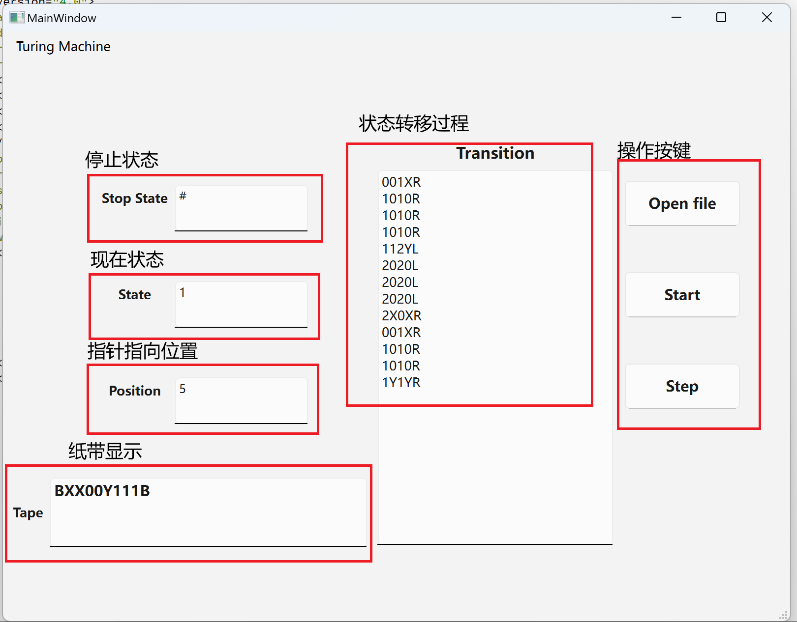

# **图灵机**

## **项目介绍**
东北大学计算理论小作业，设计通用图灵机。

## **图灵机使用说明**

1. **创建测试文件**
   
    - 请先创建一个test.txt文件
    - 文件中第一行是要进行处理的字符串
    - 第二行是结束标识符号
    - 以下部分是状态转移方程
    - 实例在[查看测试文件](example/test.txt)
  
2. **运行说明**
   
   - 点击Open file按键选择测试文件
   - 点击Start按键开始测试
   - 点击Step按键进行下一步

3. **实例说明**
   

---

# **Turing Machine**

## **Project Overview**
A computational theory assignment at Northeastern University to design a universal Turing Machine.

## **Turing Machine Usage Guide**

1. **Create a Test File**
   
   - First, create a `test.txt` file.
   - The first line of the file contains the string to be processed.
   - The second line specifies the termination symbol.
   - The following lines define the state transition table.
   - See an example in [Test File](example/test.txt).

2. **How to Run**
   
   - Click the **Open file** button to select the test file.
   - Click the **Start** button to begin the test.
   - Click the **Step** button to proceed to the next step.

3. **Example**
   
